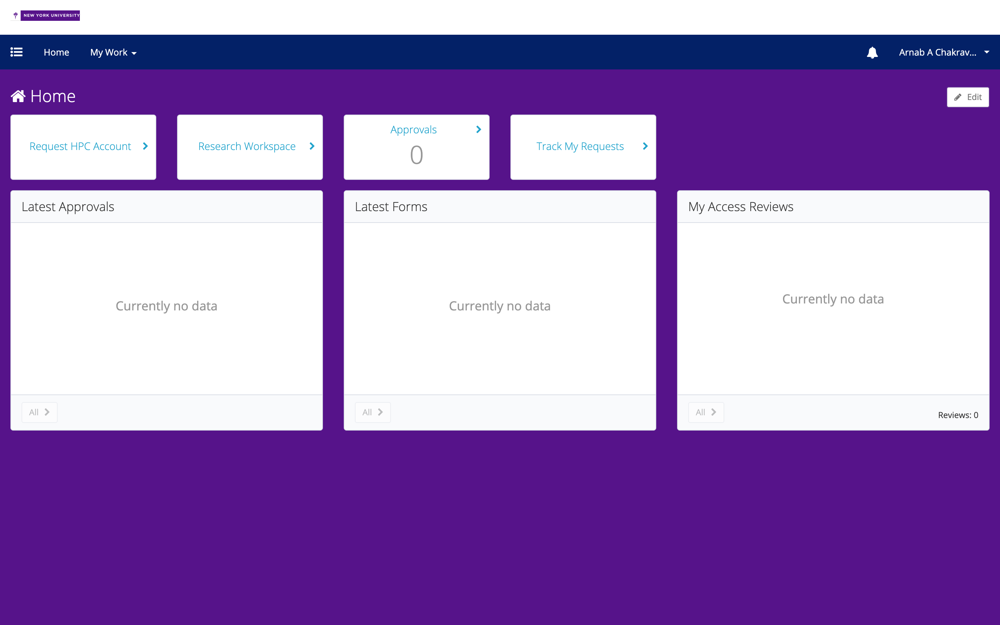
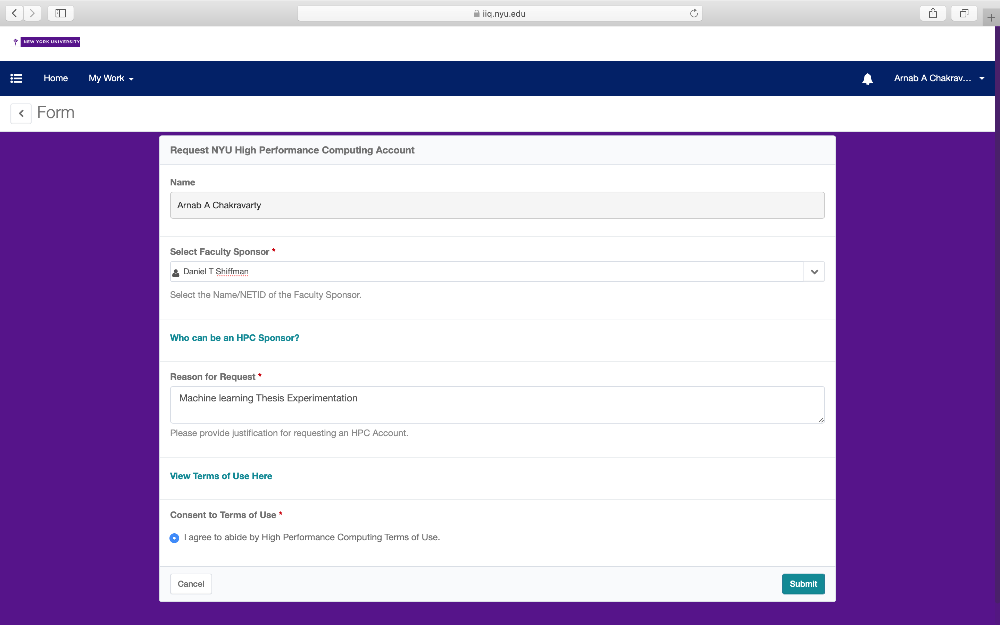
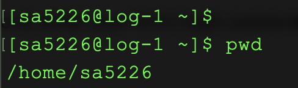

# Creating an account

* The first step to using HPC is by creating an account with your NYU credentials at  [this page](https://iiq.home.nyu.edu/identityiq) 

* Select "*Request HPC Account*"

  

* Fill in the details on the form. You will need a faculty member to approve/sponsor your account. The list of sponsors is pre-populated and might take a minute or so to load, be patient!

* You will be taken back to the first screen, and it might appear as if nothing happened. Click on "*Track my Requests*" to ensure the form went through.

* Wait for an approval email!

  

---

Once you have approval, the next step is to configure SSH access. SSH stands for *Secure Shell* -- it is a protocol to connect to a computer other than yours over the network. There are different *clusters* of computers on HPC -- you will probably want to work on the [Prince Cluster](https://wikis.nyu.edu/display/NYUHPC/Clusters+-+Prince)

* Open up a terminal / command line window

* If you are **not on the NYU network**,
  * First ssh into the network `ssh NETID@gw.hpc.nyu.edu`. You will be prompted for your password (same as you normal NYU Net ID password)
  * Then ssh into prince `ssh prince`, and put in your password once more when you are prompted to
* If you are **on the NYU network**,
  * ssh into HPC `ssh NETID@prince.hpc.nyu.edu` and put in your password
* Congratulations, you're logged into HPC!
* You should see a prompt with your Net ID, and if you type in `pwd` you will see the directory you are in -- which will correspond to your Net ID again.
* You can exit by typing the command `exit` which will return you to your local machine. (If you are *not* on the NYU network, you will need to `exit` twice)