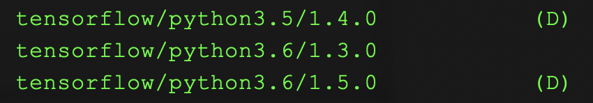
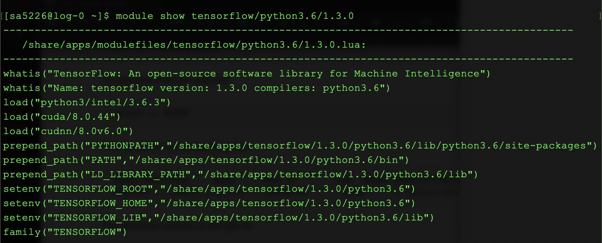

# Modules

HPC compute nodes are like blank slates, with close to nothing installed on them. To run your code, you will need to install *modules* -- these could be things like python, numpy, tensorflow etc.

**Ensure you are on a compute node before doing this**

To view available modules, use the command

```
module avail
```

You will see a long list of modules, listed with their names and version numbers. Here's a small snippet of the listed modules



The first `tensorflow` is version `1.4.0` and it runs with `python3.5`

The other two, versions `1.3.0` and `1.5.0` run with `python3.6`


You can use the `module show` command to see more information about a specific module. For eg, the image below is the output for

```
module show tensorflow/python3.6/1.3.0
```



These lines indicate the modules that will be loaded as dependencies:

```
load("python3/intel/3.6.3")
load("cuda/8.0.44")
load("cudnn/8.0v6.0")
```


To load a module, use

```
module load tensorflow/python3.6/1.3.0
```

To view currently installed modules:

```
module list
```

To remove all modules:

```
module purge
```


****

### Virtual Environments

Sometimes the modules you need might not be available on HPC. You can get around this by creating a *virtual environment* -- a little world in which you install the packages you need. You can separate environments for different tasks you run, ensuring you don't run into package version conflicts. (For example, a certain task might require `tensorflow-gpu v1.14` and another might need `tensorflow-gpu v1.10` -- having both of them installed could lead to errors, where as keeping them in separate environments ensures you only have the exact version you need)

To create a virtual environment, ensure you have python loaded first (whichever version you need):

```
module load python3/intel/3.6.3
```

The create a directory that stores your environment and packages (replace `myVirtualEnv` with whatever name you want). You only need to do this once :

```
virtualenv -p python3 $HOME/myVirtualEnv
```

Activate you environment. 

```
source $HOME/myVirtualEnv/bin/activate
```

Install the packages you need (eg `tensorflow-gpu`):

```
pip install tensorflow-gpu 
```

You can now run your code.

At a later time, when you want to run the code again, you do not need to recreate the environment, but you will need to activate it. 


---

### Queued jobs

When you queue a job, you can simply include the commands to install your modules in your script. For eg. 

```
#!/bin/bash
#SBATCH --nodes=1
#SBATCH --ntasks-per-node=1
#SBATCH --cpus-per-task=2
#SBATCH --time=4:00:00
#SBATCH --gres=gpu:2
#SBATCH --mem=64GB
#SBATCH --job-name=myTrainingJob
#SBATCH --mail-type=ALL
#SBATCH --mail-user=NYNETID@nyu.edu
#SBATCH --output=myJobOutput_%j.out

# remove all currently installed modules, just to be safe
module purge

module load tensorflow/python3.6/1.3.0

source $HOME/myVirtualEnv/bin/activate

python myPythonScript.py
```


---


**A note about loading cuda and cuDNN**

When loading `cuda` and `cuDNN` , the versioning system can sometimes get confusing. 

`cudnn/8.0v6.0` implies that it is v6.0 of cuDNN, to be used with `cuda/8.0.44` .

 That is, the first numbers listed for `cudnn`  correspond to the version of `cuda` it is intended for, and the second set of numbers are the `cudnn` version.

[This](https://www.tensorflow.org/install/source#tested_build_configurations) page lists out the versions of `cuda` and `cudnn` needed for different versions of `tensorflow` and `tensorflow-gpu`

