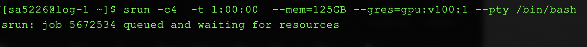

# Requesting Resources 

**Note: this section only goes over requesting resources. Read the modules section after this to put this to use**

When you login to HPC, you start off on a *login node*. These nodes are not meant for computationally intensive tasks -- those should be performed on *compute nodes*, by requesting for resources.


The `log-1` part on the prompt indicates that this is a *login* node.

There are 2 ways to run tasks on a *compute node* -- in *interactive mode* or by *queuing a job*. The interactive mode is great for short, quick jobs, or to troubleshoot and figure out if your code runs. If you quit your terminal while running in interactive mode, your job will be killed. Long running jobs should always be queued.


### Interactive mode

To use compute nodes interactively, you need to specify how long you want the node for, and the resources you need. The command is called `srun`

Here is an example:

```
srun -t 1:00:00 --mem=16000 --gres=gpu:1 --pty /bin/bash
```

Breaking it down,

`-t 1:00:00` specifies the duration, in the format HH:MM:SS

`--mem=16000` specifies the RAM, where 16000 = 16 GB

`--gres=gpu:1` specifies the number of GPUs

Once you have been provided the resources, you will be logged into a *compute node*


The `c35-04` indicates this is a normal CPU compute node


The `gpu-40` indicates this is a node with a GPU.

***You can now install the packages required by your code and run it! See the [moodules](/modules.md) page for more.***

When you are done running your code, you can type `exit` to leave the compute node.

<br>

<br>

**Figuring out what resources you need can be a little tricky sometimes!** If you ask for less than what your code requires, you might see Out of Memory errors (OOM).  

You could also request for more GPUs, the only catch is that you must ask for the same number of CPUs per task (or more), like so:

```
srun -t 1:00:00 -c 4 --mem=16000 --gres=gpu:4 --pty /bin/bash
```

`-c 4` specifies 4 CPUs per task, corresponding with `--gres=gpu:4`

***Note: asking for more resources might involve a longer wait time***



Stuck waiting for resources ....


**Requesting specific resources [Advanced]**   

In certain situations, you might need to request for specific resources -- for eg, if you need GPUs with high RAM. [This page](https://wikis.nyu.edu/display/NYUHPC/Clusters+-+Prince) on NYU HPC's wiki lists out all the resources that are available, which can help identify what you might need. There are 2 ways to specify the resources --

* Using the generic name / model identifier of the gpu

  ```
  srun -t 1:00:00 --mem=16000 --gres=gpu:p100:1 --pty /bin/bash
  ```

  Note the `p100` in `--gres=gpu:p100:1` . You could request for `v100`, `k80`, `p40` etc -- referencing the list. 

* Sometime you might want to be more specific on the resources, and can specify a partition. For eg,  the list of resources on Prince shows two V100 GPUs (**V100** SXM2 and **V100** PCIe). You can specify which one you need with the `--partition` flag, like so:

  ```
  srun -c4  -t 1:00:00 --partition=v100_sxm2_4 --mem=125GB --gres=gpu:4 --pty /bin/bash
  ```

  To find the name, you can browse the list of resources on hpc with the `sinfo` command.

  

---


### Batch mode

You can queue up jobs in batch mode by listing the required resources and commands in a file. 

For eg, make a file in your `$HOME` directory with the extension `.s` --

```
touch mybatchscript.s
```

The required resources can be listed out in the file like so:

```
#!/bin/bash
#SBATCH --nodes=1
#SBATCH --ntasks-per-node=1
#SBATCH --cpus-per-task=2
#SBATCH --time=4:00:00
#SBATCH --gres=gpu:2
#SBATCH --mem=64GB
#SBATCH --job-name=myTrainingJob
#SBATCH --mail-type=ALL
#SBATCH --mail-user=NYNETID@nyu.edu
#SBATCH --output=myJobOutput_%j.out


# COMMANDS TO RUN YOUR CODE AND INSTALL PACKAGES WOULD GO HERE ( SEE MODULES SECTION FOR MORE )
```

This corresponds to the details used for interactive mode. Things to note are :

`--cpus-per-task` is the same as the `-c` you used in interactive mode, and `--time` is the same as the `-t` flag.

`--job-name` can be whatever you choose, it's best if you make it adequately descriptive

`--mail-type` is to specify when you want to receive email alerts about your job (when it starts, ends, or both). `--mail-user` is the email address to send status updates to.

`--output` is to specify the name of the output log file. This is **not** where the output of your training goes, it is a file containing all the text that would normally be printed to your terminal window in interactive mode. You can name this whatever you want. The `%j` and the end is to add the job number to the name, so the file name is unique and easy to identify.


To queue the file (after you put in the commands to run your code as well), do this:

```
sbatch mybatchscript.s
```

You will see a job number printed to confirm your job has been added to the queue. 

You can always view your queue like so (putting in your NYU Net ID):

```
squeue -u NETID
```

Which will print something like this:

```
JOBID PARTITION     NAME     		USER ST       		TIME  		NODES NODELIST(REASON)
2103847     p40_4 myTrainingJob    sa5226 PD       0:00      1 (Resources)
```

If your job is queued, you can get a rough estimate of when it will start with this command, putting in the JOBID number:

```
squeue --start --job 2103847
```


