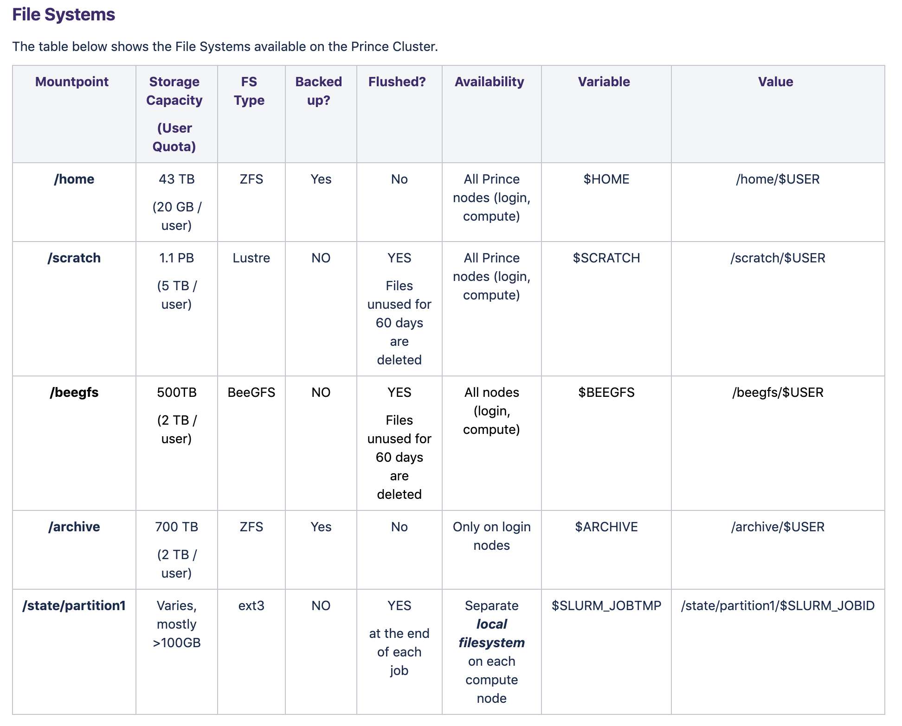

# Storage

There are a number of storage options on the prince cluster, available at these paths:

* `/home/NETID` or `$HOME`
* `/scratch/NETID` or `$SCRATCH`
* `/beegfs/NETID` or `$BEEGFS`
* `/archive/FIRST_LETTER_OF_NETID/NETID` or `$ARCHIVE`

**They differ on a few different factors -- storage space, number of files allowed,  how long files can stay there, and ideal use.**

This screenshot from [the HPC wiki](https://wikis.nyu.edu/display/NYUHPC/Clusters+-+Prince) illustrates the differences. (Mostly, one would receive an email a week before files are deleted, but don't count on it). 



An important detail not mentioned is the ***number of files*** one can store on each file system. 

* `$HOME` and `$SCRATCH` have *no limit on the number of files*
* `$SCRATCH` allows for 1 million files
* `$BEEGFS` allows for 3 million files

While this might seem like a lot, it might be a factor to consider when training on large datasets, or if one is storing multiple datasets on HPC at the same time.


----


### Deciding what to use

*~~ ~~ ~~ ~~ ~~ The following text is borrowed from [Dan Oved's workshop notes](https://github.com/oveddan/itp_presentations/blob/master/hpc/getting_started.md)* ~~ ~~ ~~ ~~ ~~


**$HOME**

When you first login, you are always dropped into your `$HOME` directory. You are limited to **20GB** of storage here, but files here are permanent. **This is where your code should go.** To navigate here from other parts of the system:

```
cd $HOME
```


**$SCRATCH**

Each user gets **5TB of storage** on the `$SCRATCH` drive. Files here are semi-permanent; **files unused for 60 days are removed automatically.** Use `$SCRATCH` for storing your data, such as images, videos, sounds, and trained models. It can be accessed by:

```
cd $SCRATCH
```


**$BEEGFS**

Each user gets **2TB of storage** on the `$BEEGFS` drive. Files here are semi-permanent; **files unused for 60 days are removed automatically.** Use `$BEEGFS` for storing your data, such as images, videos, sounds, and trained models. It can be accessed by:

```
cd $BEEGFS
```

***When to use `$BEEGFS` or `$SCRATCH`?***

Generally speaking `$BEEGFS` file system is optimized for **small IOs and small files,** `$SCRATCH` is optimized for **big files and big IOs.**


**$ARCHIVE**

Each user gets **2B of storage** on the `$ARCHIVE` drive. Files here are permanent, but cannot be accessed by any `compute` jobs (read XYZ file for more on this). **Use this for archiving your data that you no longer need to access but don't want to have deleted.**

```
cd $ARCHIVE
```


----


**You can always view how you're doing with your quota with the command `my quota`**


