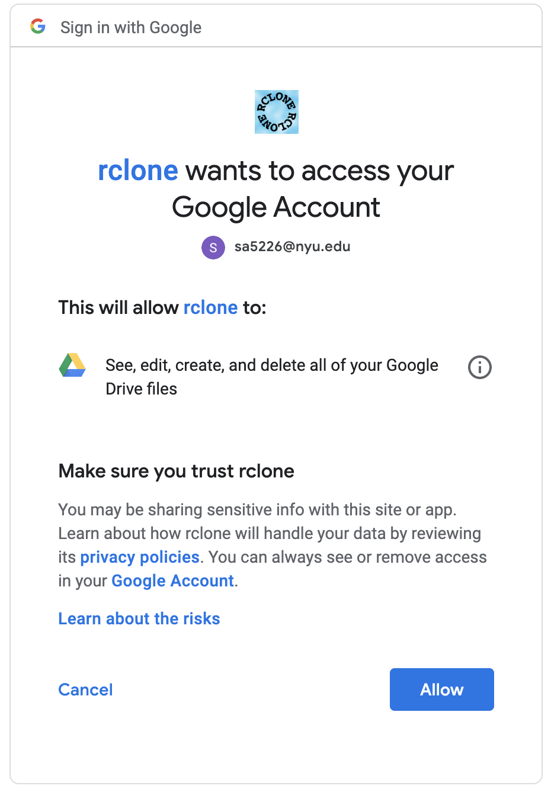

# Transferring data

There are two main ways of transferring data to and from HPC. The first is transferring data to and from your computer, using `scp` (secure copy), which works over `ssh`. The second method is by transferring to and from Google Drive (or other cloud storage solutions) -- which can be handy when you have limited space available on your computer.


---


### To / from your computer

**The first step is to create an SSH tunnel. You only need to do this once**

1. On your computer, check if you have an `.ssh` directory already
   `ls ~/.ssh`

2. If you see some filenames printed, skip to the next step. 

   Else, if this returns `no such file or directory`, 

   create the directory like so `mkdir ~/.ssh`, 

   and then set the permissions - `chmod 700 ~/.ssh`, 

   and create a new file called config :  `touch ~/.ssh/config`

3. Open the `config` file in a text editor (for eg, `vim ~/.ssh/config`) and add this, replacing `NETID` with your NYU Net ID:

   ```
   # first we create the tunnel, with instructions to pass incoming
   # packets on ports 8024, 8025 and 8026 through it and to specific
   # locations
   Host hpcgwtunnel
      HostName gw.hpc.nyu.edu
      ForwardX11 no
      LocalForward 8026 prince.hpc.nyu.edu:22
      User NETID 
   # next we create an alias for incoming packets on the port. The
   # alias corresponds to where the tunnel forwards these packets
   Host prince
     HostName localhost
     Port 8026
     ForwardX11 yes
     User NETID
   ```


**Transferring ** 

Once this is done, you're ready to transfer files between your computer and HPC.

1. Open a terminal window and create a tunnel

   ```
   ssh hpcgwtunnel
   ```

2. Open a **new terminal window** to transfer files

   The general format of the command to transfer files is

   ```
   scp {SOURCE PATH} {DESTINATION PATH}
   ```

   

   Let's assume you have a file called `myfile.txt` on your Desktop (on a mac), that you want to transfer to the `scratch` file system on HPC, in a folder you called `mydata`. The command will be (replace `NETID` with your NYU NetID) --

   ```
   scp ~/Desktop/myfile.txt NETID@prince:/scratch/NETID/mydata/
   ```

   If you wanted to transfer the file back to your Desktop,

   ```
   scp NETID@prince:/scratch/NETID/mydata/myfile.txt ~/Desktop/
   ```

   If you want to transfer a directory to your `mydata` folder on HPC, you need to include the `-r` option (for `recursive`), like so:

   ```
   scp -r ~/Desktop/myfolder NETID@prince:/scratch/NETID/mydata
   ```

   

    

---


### To / from Google Drive

Sometimes its easier to store your files on Google Drive, since there is large amounts of space available on Drive with NYU accounts. You could collect the dataset on your computer and then store it on Drive to free up space on your machine. 

**In order to get this working, you need to configure HPC to communicate with your Drive account ( you only need to do this once )**

1. Log into HPC

2. Instead of `scp`, we will use `rclone`. We can install this like so (more on modules in the XYZ file)

   ```
   module load rclone/1.38
   ```

3. Start the configuration tool

   ```
   rclone config
   ```

   You will see this output:

   ```
   No remotes found - make a new one
   n) New remote
   s) Set configuration password
   q) Quit config
   n/s/q> 
   ```

4. Type in `n` to create a New remote, which should prompt you for a name. You can name your remote whatever you like (as long as you remember it!) (`mygoogledrive` in this case)

   ```
   name> mygoogledrive
   ```

5. You will see a whole bunch of options, with numbers next to them:

   ```
   Type of storage to configure.
   Choose a number from below, or type in your own value
    1 / Amazon Drive
      \ "amazon cloud drive"
    2 / Amazon S3 (also Dreamhost, Ceph, Minio)
      \ "s3"
    3 / Backblaze B2
      \ "b2"
    4 / Box
      \ "box"
    5 / Dropbox
      \ "dropbox"
    6 / Encrypt/Decrypt a remote
      \ "crypt"
    7 / FTP Connection
      \ "ftp"
    8 / Google Cloud Storage (this is not Google Drive)
      \ "google cloud storage"
    9 / Google Drive
      \ "drive"
    Storage>
   ```

   Type in the number corresponding to Google Drive

   ```
   Storage> 9
   ```

6. You can leave the next two prompts blank (for `client_id` and `client_secret`, and just hit enter

   ```
   Google Application Client Id - leave blank normally.
   client_id>  
   Google Application Client Secret - leave blank normally.
   client_secret> 
   ```

7. The tool will now ask you if you want to use `auto config`, select `n` since you are working on a remote or headless machine

   ```
   Remote config
   Use auto config?
    * Say Y if not sure
    * Say N if you are working on a remote or headless machine or Y didn't work
   y) Yes
   n) No
   y/n> n
   ```

8. The tool will now spit out a long URL at you -- your browser may or may not open automatically. If it doesn't, navigate to the link on your browser, and click on *Allow Access*

   

9. Paste the code back in the terminal

   ```
   Enter verification code> YOURCODE
   ```

10. The tool will ask about configuring this as a team drive, you can say no

    ```
    Configure this as a team drive?
    y) Yes
    n) No
    y/n> n
    ```

11. It will then show you some details (the name you selected and a token), and you can confirm this is okay

    ```
    y) Yes this is OK
    e) Edit this remote
    d) Delete this remote
    y/e/d> y
    ```

12. You're done with the setup! Quit the config tool

    ```
    q) Quit config
    e/n/d/r/c/s/q> q
    ```

    

**Transferring**

The format for transferring with `rclone` is similar to `scp` --

```
rclone copy {SOURCE_PATH} {DEST_PATH}
```

1. Create a folder on your Google Drive to transfer the file to, for eg `hpc_uploads`

2. To transfer a file (`myfile.txt`) in your `$HOME` directory on HPC to Google drive:

   ```
   rclone copy /home/NETID/myfile.txt mygoogledrive:hpc_uploads
   ```

   Replace `NETID` with your NYU Net ID, and replace `mygoogledrive` with the name you decided on in step 4 during the setup phase. 

3. To transfer a directory, one does not need to do anything different --

   ```
   rclone copy /home/NETID/mydirectory mygoogledrive:hpc_uploads
   ```

4. To download file from Google drive to HPC, we just change the source and destination paths:

   ```
   rclone copy mygoogledrive:hpc_uploads/mydata /scratch/NETID/mydata
   ```

   

